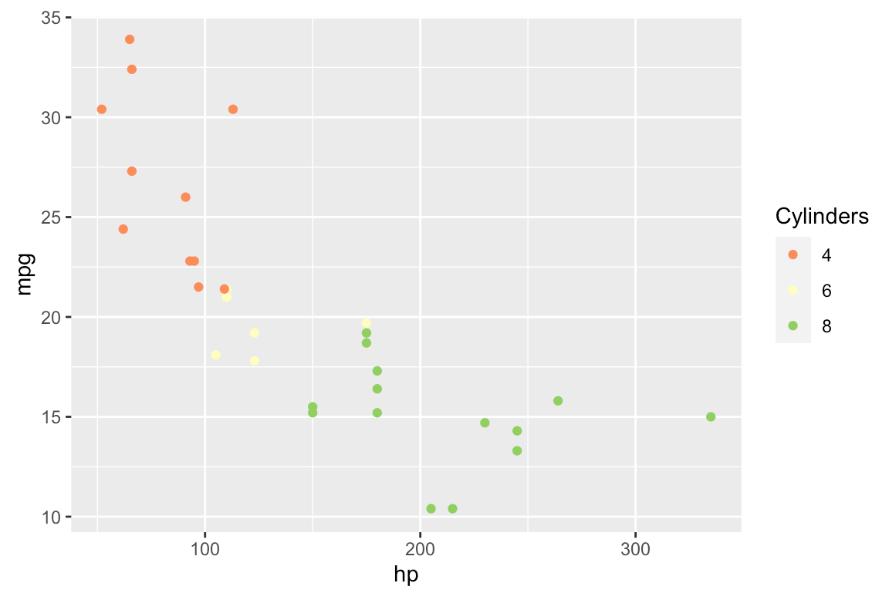
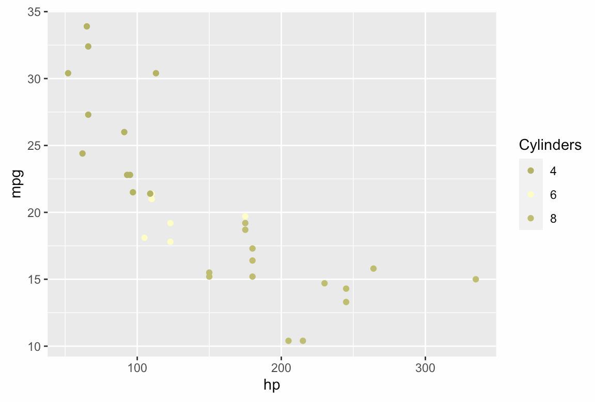

# Accessibility Checklist

Review this guide when publishing StatLab articles or finalizing public-facing R Markdown/Quarto documents.

- Use proper headers to delineate sections and levels of content (#, ##, etc.)
- Refer to functions with `()` appended (`mean()` > `mean`)
- [Label all graphics with alt text](#alt-text)
- [Use colorblind-friendly palettes in plots](#colorblind-friendly-plots)
- [Remove hash/number signs from R output: `opts_chunk$set(comment="")` (for Rmd/Quarto files)](#remove-hash-signs-from-r-output)
- [Embed hyperlinks in text strings that balance concision and descriptiveness](#hyperlinks)
- [Use LaTeX, not images, for formulas and expressions, although skip it for simple, in-text math elements (x, y, etc.)](#latex)

---

### Alt text

Alt text should be succinct and provide equivalent information to the graphic it describes.

- Avoid redundancy: Don't start alt text with "graphic of...," "a photo of...," etc.
- Alt text doesn't need to communicate every descriptive detail: The point is to get across the content and function of the graphic
  - "Snow-covered forest seen from above" is preferable to "A cluster of deciduous trees in late November with snow covering about two-thirds of their branches; most but not all are lacking leaves, and a sign with unreadable text is nailed to a low post toward the left of the image, which appears to have been taken from between 200 and 300 feet off of the ground"

In R Markdown/Quarto documents, alt text can be added before the image path:

``

By default, alt text will appear as a caption under its corresponding image. It can be left as invisible alt text by modifying the YAML header with `fig_caption: false`:

```
output:
  html_document:
    fig_caption: false
```

Alt text can alternatively be added directly to an HTML statement:

``

---

### Colorblind-friendly plots

Color blindness can make interpreting color-based plots difficult. For example, the following plot:



Would appear (approximately) to a person with deuteranopia (red-green color blindness) as:



Opt for colorblind-friendly palettes when generating plots. A set of palettes is available in the R package `RColorBrewer` via:

`RColorBrewer::display.brewer.all(colorblindFriendly = T)`

Also consider using an app like [Color Oracle](https://colororacle.org/index.html) to evaluate how a plot would look with various forms of color blindness.

---

### Remove hash signs from R output

By default, the output of an R code chunk in an Rmd/Quarto file will include leading hash signs. The output of an R chunk containing `1 + 1` will appear as:

`## 2`

Eliminating the double hash signs will prevent a screen-reader from saying "number, number" before reading out each line of results.

To remove the double hash signs globally in an Rmd/Quarto document, add the following to the R setup chunk:

`opts_chunk$set(comment = '')`

Or, remove them chunk-by-chunk by adding `comment = ''` to the header of each code block.

---

### Hyperlinks

Embed links in text; don't simply paste in a full URL. Make the text communicative and concise:

- "[Tips for writing accessible content](https://github.com/uvastatlab/accessibility_checklist)" is better than "[tips](https://github.com/uvastatlab/accessibility_checklist)", and both are better than "https://github.com/uvastatlab/accessibility_checklist"
- If a hyperlink leads to a downloadable file, communicate that: [US Securities and Exchange Commission "plain language" handbook (PDF, 1.06 MB)](https://www.sec.gov/pdf/handbook.pdf)

---

### LaTeX

Use LaTeX to show formulas and expressions. Don't embed an image containing mathematical content; a screen-reader won't be able to parse and read out the content from an image.

LaTeX can be skipped for simple, in-text math content: "We take the square of _x_ and subtract _y_ from it."

---

References and hat-tips:

- [Slides from a 2022 WebAIM presentation to UVA employees](https://webaim.org/presentations/2022/uva-docs/)
- [NCSU notes on accessible hyperlinks](https://accessibility.oit.ncsu.edu/accessible-hyperlinks/)
- ["Accessible R Markdown Documents" by Jonathan Godfrey](https://r-resources.massey.ac.nz/rmarkdown/)
